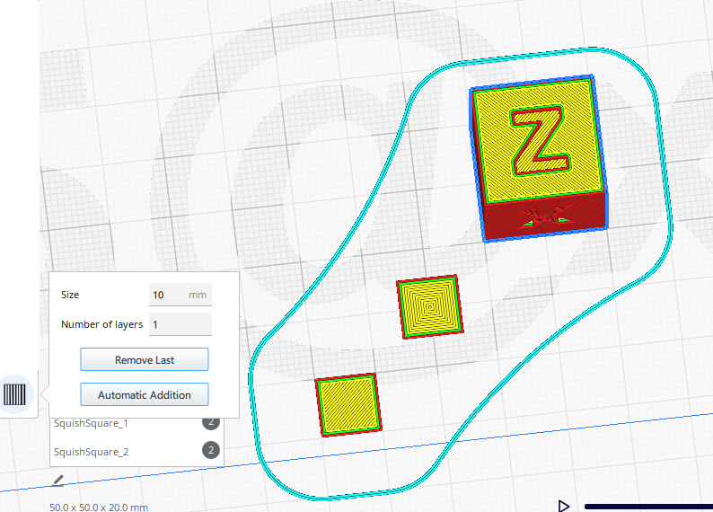
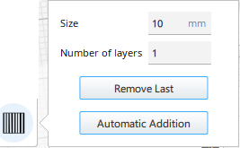
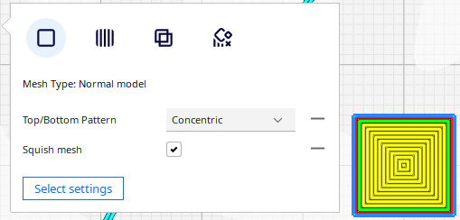
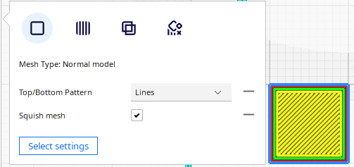

# Squish Square
Add two elements as square Tab to test the leveling of your bed effect in print corner. 

The automatic functions of adding and deleting tabs make it easy to create each elements.

## Installation
First, make sure your Cura version is  4.4 or newer.

Manual Install Download & extract the repository as ZIP or clone it. Copy the files/plugins/SquishSquare directory to:

on Windows: [Cura installation folder]/plugins/SquishSquare

on Linux: ~/.local/share/cura/[YOUR CURA VERSION]/plugins/SquishSquare (e.g. ~/.local/share/cura/4.6/plugins/SquishSquare)

on Mac: ~/Library/Application Support/cura/[YOUR CURA VERSION]/plugins/SquishSquare

## How to use

- Load a model in Cura and select it
- Click on the "Squish Square" button on the left toolbar  (Shortcut S)
- Change de value for the tab *Size* in numeric input field in the tool panel if necessary

- Click anywhere on the model to place "Squish Square" in the lower corner of this model.

- **Clicking existing Tab deletes it**

- **Clicking existing Tab + Ctrl** switch automaticaly to the Translate Tool to modify the position of the "Squish Square".

* The height of the tabs is automaticaly set to the Initial Layer Height .

>Note: it's easier to add/remove tabs when you are in "Solid View" mode

## Automatic Addition

Add automaticaly two tabs on the point in the lower corner of the model

The first one is defined with the option Top/Bottom pattern to **concentric**.

The second one is defined with the option Top/Bottom pattern to **lines**.

## Remove All / Last

Button to remove the lasts tab created ( **!but also every element defined as Squish Mesh** )

