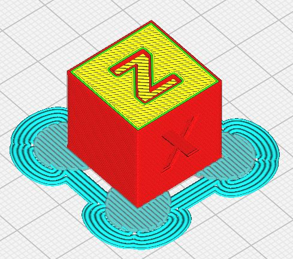

# Suish Square
Add two elements as square Tab to test the leveling of your bed effect in print corner. 

The automatic functions of adding and deleting tabs make it easy to create each elements.

## Installation
First, make sure your Cura version is  4.4 or newer.

Manual Install Download & extract the repository as ZIP or clone it. Copy the files/plugins/TabAntiWarping directory to:

on Windows: [Cura installation folder]/plugins/TabPlus

on Linux: ~/.local/share/cura/[YOUR CURA VERSION]/plugins/TabAntiWarping (e.g. ~/.local/share/cura/4.6/plugins/TabAntiWarping)

on Mac: ~/Library/Application Support/cura/[YOUR CURA VERSION]/plugins/TabAntiWarping

## How to use

- Load a model in Cura and select it
- Click on the "Squish Square" button on the left toolbar  (Shortcut S)
- Change de value for the tab *Size* in numeric input field in the tool panel if necessary

- Click anywhere on the model to place "Squish Square" there

- **Clicking existing Tab deletes it**

- **Clicking existing Tab + Ctrl** switch automaticaly to the Translate Tool to modify the position of the "Tab Anti Warping".

* The height of the tabs is automaticaly set to the Initial Layer Height .

- Change de value for the tab *X/Y Distance* in numeric input field in the tool panel if necessary this value will adjust the distance between the tab treated as support and the model . By keeping enought distance, the tab will be easier to remove. 

>Note: it's easier to add/remove tabs when you are in "Solid View" mode

## Automatic Addition

Add automaticaly the tab on the point of the Convex hull representation of the part.

The option "Set On Adhesion Area" offer to adds the tabs on the Adhesion Area border.

## Remove All / Last

Button to remove the lasts tab created ( **!but also every element defined as Squish type** )

